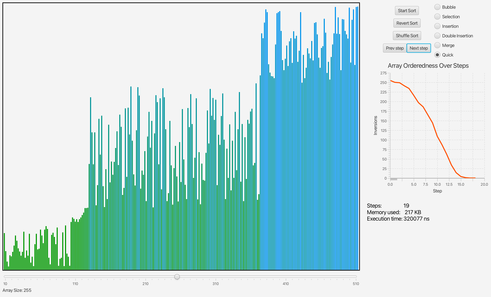

# Sorting Visualizer

This project is my attempt to study Java and JavaFX by creating a sorting algorithms visualizer.  
I implemented several classic sorting algorithms with step-by-step visual animations, along with additional performance analysis features such as:

- **Number of comparisons**
- **Memory usage**
- **Execution time**
- **Charting the degree of sortedness over each step**

The project was built as part of my personal portfolio to showcase my skills in **Java**, **UI development with JavaFX**, and **building clean application architecture**.
Unfortunately sorting statistic is not showing huge difference between algorithms because of the scale. I believe the reasonable difference in time and memory usage will be case of arrays of 10^6 of elements. But in this scale visualisation seems impossible and makes no sense.
But you can use sorting algorithms on a big scale separately.

## Features
- Visualization of multiple sorting algorithms (Bubble Sort, Quick Sort, Merge Sort, etc.)
- Step-by-step sorting animation
- Performance metrics tracking
- Dynamic array size adjustment
- Degree of sortedness chart during sorting

## How to Run
1. Make sure you have **JDK 17+** and **Maven** installed.
2. Clone the repository:

   ```bash
   git clone https://github.com/palekseev-chilleev/sorting_visualizer.git
Navigate into the project directory:


3. Enter directory:
```bash
cd sorting_visualizer
```

4. Build the project:
```bash
mvn clean install
```
5. Run the application:
```bash
mvn javafx:run
```

